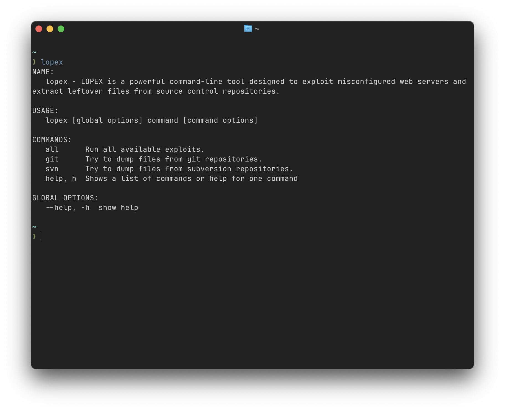

# LOPEX: Leftover Project Extractor



LOPEX is a powerful command-line tool designed to exploit misconfigured web servers and extract leftover files from source control repositories. With its intuitive interface and efficient algorithms, LOPEX automates the extraction process, swiftly identifying and retrieving files that have been inadvertently left behind due to misconfigurations.

## Key Features:
- **Efficient Extraction:** LOPEX swiftly scans misconfigured web servers and extracts leftover project files from source control repositories, saving valuable time and effort.
- **Command-Line Interface:** Designed for simplicity and ease of use, LOPEX features a user-friendly command-line interface that allows users to initiate extraction tasks with minimal effort.
- **Customizable Options:** LOPEX offers customizable options, enabling users to specify target directories, file types, and extraction methods to suit their specific requirements.
- **Comprehensive Reporting:** Upon completion of extraction tasks, LOPEX generates comprehensive reports detailing the extracted files, their locations, and any relevant metadata, facilitating thorough analysis and review.

## Installation

To install LOPEX, you can use the `go install` command:

```sh
go install github.com/lczerniawski/LOPEX@latest
```

This command will download the repository, build the application, and install the binary in your $GOPATH/bin directory.

Make sure your $GOPATH/bin directory is in your system's PATH so you can run the installed CLI tool from anywhere.

Alternatively, you can follow these steps:

1. Clone the repository:
```sh
git clone https://github.com/lczerniawski/LOPEX.git
```
2. Navigate to the project directory:
```sh
cd LOPEX
```
3. Build the project:
```sh
go build
```
4. Run the executable:
```sh
./lopex
```


## Usage:

To use LOPEX, simply execute the command with the desired option. For example:
lopex


### Commands:

* `all`        Run all available exploits.
* `git`       Try to dump files from git repositories.
* `svn`       Try to dump files from subversion repositories.
* `help`, `h`  Shows a list of commands or help for one command

### Command Options:
```
Usage: lopex [command] [command options] [arguments...]
```

Options: 
* --url value, -u value Url to look for the files
* --outputFolder value, -o value Output folder for the dumped repo (default: "repo-dump") 
* --help, -h show help


### Currently Planned:

* IDEs files support
